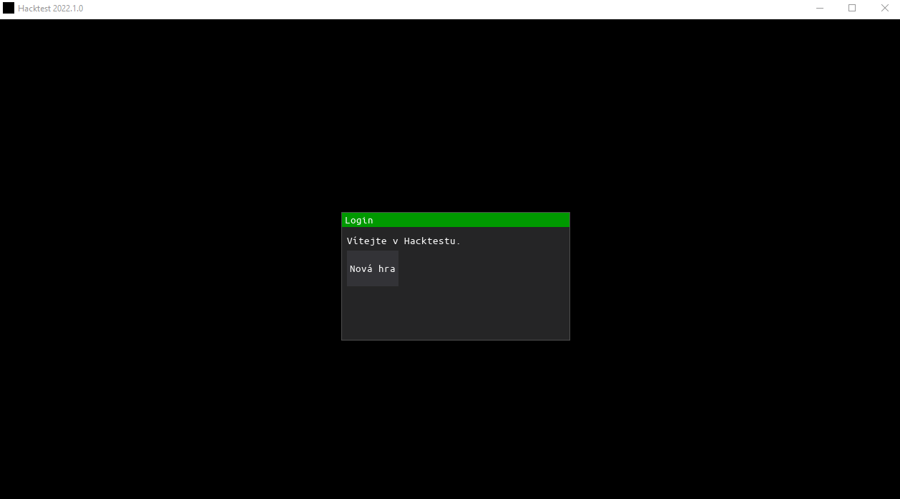

# Hacktest

Simple "hacking" simulator game created for a school event in 2022. Created using Python 3.10 and DearPyGUI.

Required a backend (private repo) to store and track contestant progress in a server database. Modified for offline use.

Minimum requirements:

- OS: Windows 10 or newer
- Disk: 40 MB of free space
- Internet connection: yes

## Developers

- [Niksld](https://github.com/Niksld)
- [Ondrejtra](https://github.com/Ondrejtra)
- [MichaelCZE](https://github.com/MichaelCZE)

## __Note__

This game was made with now deprecated tools and doesn't work correctly anymore. Also of note is the .exe release - which Windows now falsely flags
as a virus. This is due to an (at the time) unresolved PyInstaller issue and the fact the game has no digital signature.

This repo is __not__ an updated version of the game, just a public release of the old code.

## EXE bundling via PyInstaller

- Clone or download the repository
- `cd` to the `src` folder within
- Run `pyinstaller -F --onefile --windowed --icon .\resources\images\hacker.ico --add-data "resources;resources" -n Hacktest main.py`
  - The Python Scripts folder has to be in PATH for plain `pyinstaller` to work, you can also point to the PyInstaller executable directly instead
  - Required non-bundled Python modules are listed in [requirements.txt](requirements.txt)
- The resulting EXE file can be found in `src/dist`
- Before running again, remove `src/Hacktest.spec`, `src/dist`, `src/build` and `src/__pycache__`

## Running the project

- Install requirements via:

```bash
pip install -r requirements.txt
```

- Run the game

```bash
python3 ./src/main.py
```

## Preview

